# Launchpad

Make Claude operate at its best on a project: disciplined context, a memory that survives
`/clear` and is shared across agents, a non-generic voice, and an agent-team playbook that
scales only as far as the task earns.

The guiding rule: **the cheapest structure that clears the quality bar wins.** Agents are
power you spend on purpose, never by default.

## When to use

- **Setting up** a new or unconfigured project for Claude → run the bootstrap (below).
- **Substantial work** — multi-step, multi-file, research-heavy, or high-risk → load
  `references/orchestration.md` + `references/org-structures.md` and pick a structure.
- **A consequential, hard-to-reverse decision** (launch, hire, pivot, architecture, big
  spend) → load `references/council.md` and convene.

**When NOT to use:** a one-line fix, a quick question, or tightly-coupled edits to a single
file. Stay solo. Spinning up a team there wastes tokens and slows you down.

## First-run bootstrap (Claude Code)

When the project has no `CLAUDE.md`, offer to set it up:

1. **Inspect** the repo — language, framework, package manager, test/build/lint commands,
   existing conventions.
2. **Plan** — tell the user which files you'll create. Don't write yet.
3. **Write** these from `templates/`, filling `CLAUDE.md` from what you found:
   `CLAUDE.md`, `MEMORY.md`, `ERRORS.md`, `LEARNINGS.md`, `anti-style.md`. **Skip any file
   that already exists** — never clobber the user's work unless they say so.
4. **Report** what was created and what placeholders the user should fill.

On claude.ai or the API (no filesystem): skip the writes, apply the behaviors in-session, and
offer the templates as copy-paste blocks.

## The self-learning loop (one paragraph, full detail in `references/self-learning.md`)

The project keeps three durable stores — `MEMORY.md` (decisions), `ERRORS.md` (failures +
fixes), `LEARNINGS.md` (techniques + research). Read the relevant entries at the start of any
task. Subagents can't read these files, so when you delegate, **paste the relevant entries
into the subagent's prompt**, and require it to return any new failure/fix or learning in its
result. **Harvest** those back into the right store. Next time, that knowledge is free.

## Orchestration overview

Default to the smallest structure. Escalate one tier only on an observable trigger; de-escalate
the moment a cheaper structure would do.

```dot
digraph pick {
  rankdir=LR; node [shape=box];
  start [label="Task arrives", shape=doublecircle];
  trivial [label="Trivial OR tightly\ncoupled / same-file?", shape=diamond];
  solo [label="SOLO\n(main thread)"];
  normal [label="A normal change\nworth reviewing?", shape=diamond];
  pair [label="PAIR\nbuild + independent review + verify"];
  indep [label=">=3 independent\nparallel subtasks?", shape=diamond];
  parallel [label="PARALLEL formation\n(Research Pod / Review Board /\nBest-of-N / Red-Blue)"];
  big [label="10+ targets or\nmulti-module?", shape=diamond];
  program [label="PROGRAM / ASSEMBLY LINE\n-> hand to a Workflow"];
  decision [label="A hard-to-reverse\nDECISION?", shape=diamond];
  council [label="COUNCIL\n5 advisors + chair"];

  start -> decision;
  decision -> council [label="yes"];
  decision -> trivial [label="no"];
  trivial -> solo [label="yes"];
  trivial -> normal [label="no"];
  normal -> pair [label="yes, small"];
  normal -> indep [label="bigger"];
  indep -> big [label="yes"];
  indep -> pair [label="no -> Strike Team / Debug TF"];
  big -> program [label="yes"];
  big -> parallel [label="no"];
}
```

The efficiency governor, escalation triggers, delegation-prompt contract, model routing, and
the claude.ai degradation path live in `references/orchestration.md`. The full catalog of 13
structures (purpose · activate-when · roles · cost · output lift) lives in
`references/org-structures.md`. Load them when you escalate beyond Pair.

## Hold the line

Violating the letter of the efficiency rules is violating their spirit. Two failure modes,
both common:

| Rationalization | Reality |
|---|---|
| "More agents = better quality, so fan out." | Multi-agent costs ~15× tokens and *hurts* on coupled work. Quality comes from the right structure, not the biggest one. |
| "This is fine, I'll skip the review/verify step." | Unverified work isn't done. The Pair's reviewer + verify gate is the cheapest quality you'll ever buy — keep it. |
| "I'll spawn a subagent and it'll figure out the context." | Subagents inherit no memory and no history — only `CLAUDE.md` + your prompt. Vague delegation = duplicate work and gaps. |
| "Logging a learning is overhead, skip it." | The self-learning loop is the whole point. Five seconds now saves the next session an hour. |

### Red flags — STOP
- You're about to spawn 3+ agents on work that touches the same files → don't; go Solo/Pair.
- You're delegating without pasting in the relevant MEMORY/ERRORS/LEARNINGS → stop, inject first.
- You're about to claim "done" without running the test/build/verify commands → not done yet.
- A structure bigger than Pair has no observable trigger justifying it → drop a tier.

## Reference map

| File | What it contains | Load when |
|---|---|---|
| `references/orchestration.md` | Efficiency governor, escalation triggers, delegation contract, model routing, degradation | Any work beyond Solo/Pair |
| `references/org-structures.md` | The 13-structure catalog with cost/quality profiles | Choosing or escalating a structure |
| `references/self-learning.md` | The inject-and-harvest protocol + file conventions | Delegating, or wiring up memory |
| `references/council.md` | The 5-advisor decision pressure-test | Before a consequential, hard-to-reverse decision |
